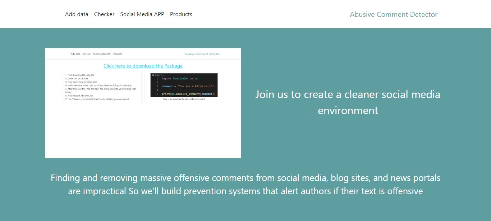
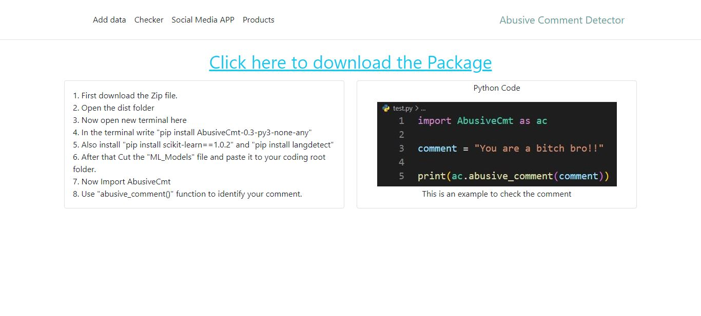
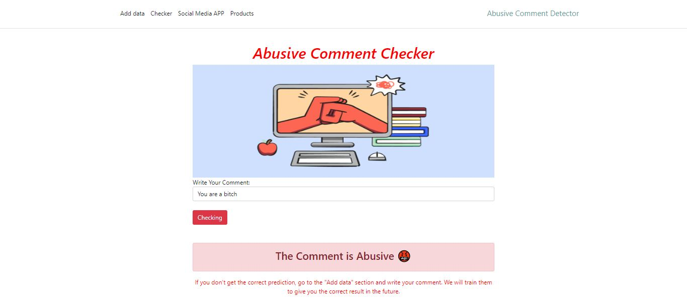
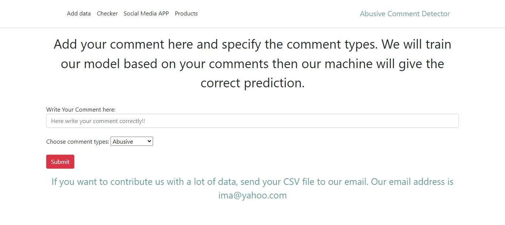
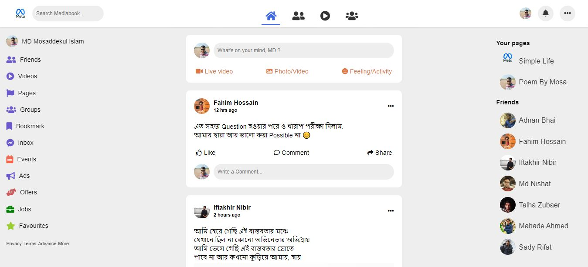
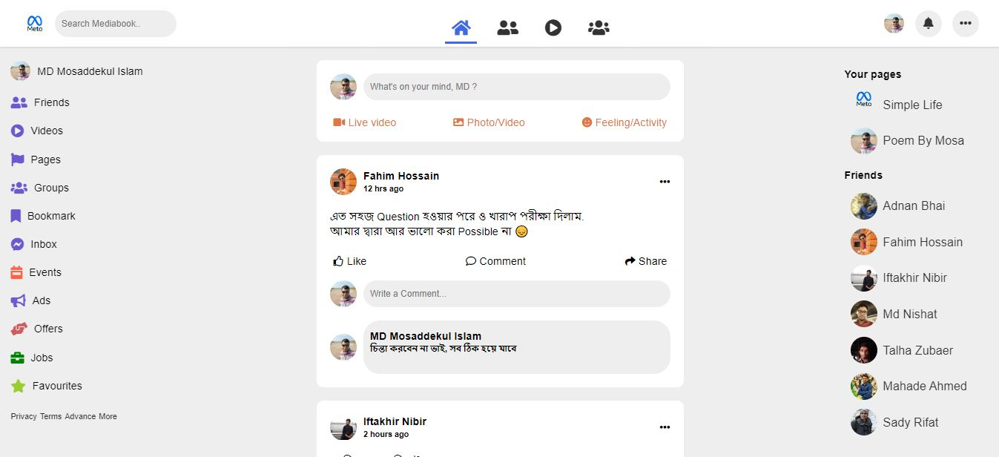
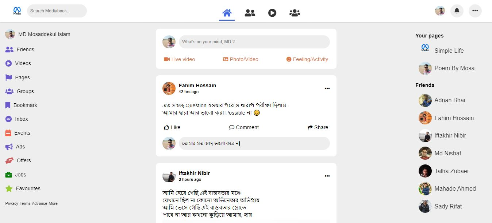
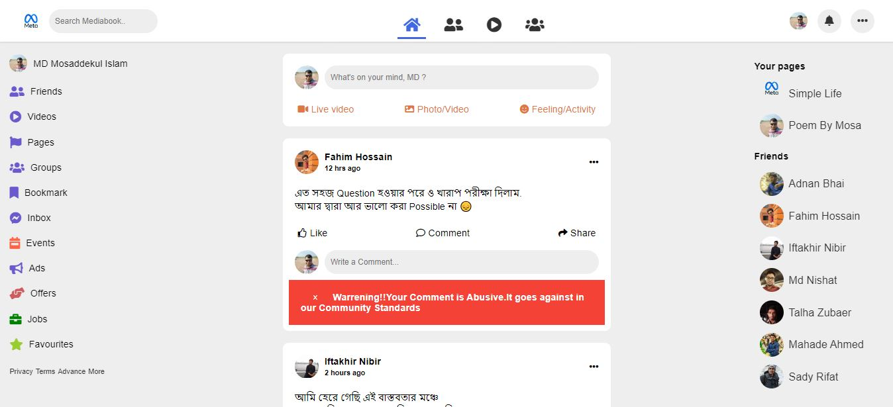

# Abusive_Comment_Detector
<h3>Here I provide the UI design of my project</h3>

This is the homepage of our project

This page shows how people can use our services

Here people can check a comment

This page tells how other people can contribute to us

This page is created to show a real example

When someone makes a positive comment, the system then posts the comment

People can also make bad comments

But it shows a warning to the user that the comment will not be posted.

